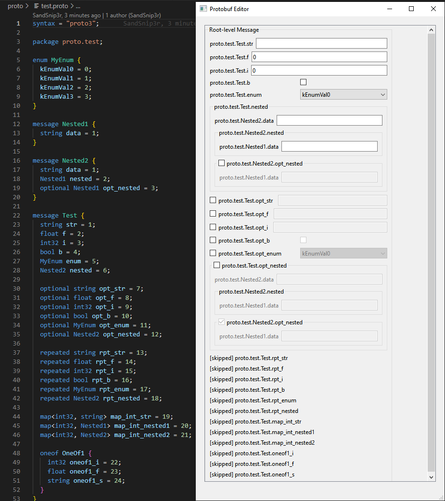

# Qt Protobuf Editor

This project provides a Qt Widget library which allows editing of arbitrary Google Protobuf messages.

## Design
There are three widget types introduced:

### BuiltInTypeWidget

`BuiltInTypeWidget` is a widget which allows editing any of the built-in protobuf plain types, such as string, enum, int, float, etc. The widget contains a label and some other widget (depending on the data-type) laid out horizontally. Optional fields have a checkbox as the label.

### MessageTypeWidget

`MessageTypeWidget` is a widget which aggregates a vertically laid out collection of `BuildInTypeWidget`s or nested `MessageTypeWidget`s.

### ProtobufEditor

`ProtobufEditor` is an example widget of how the `MessageTypeWidget` would be used.

To create a widget for editing your own protobuf message, construct a MessageTypeWidget with a pointer to the Descriptor of your message. This is sufficient for the Widget to build the UI for editing your message. Then, call `setMessage` on the widget with a pointer to your message. As the data in the UI elements are updated, the protobuf message will be updated in realtime and a signal (`messageUpdated`) will be emitted. See `protobufEditor.cpp` for an example.

## Example

## Contributions

Contributions are encouraged. Things that are not yet supported:
1. Map
2. Repeated
3. OneOf

Also, ideally I'd like to provide a way for the user to override widgets based on a specific field name, or an entire type.